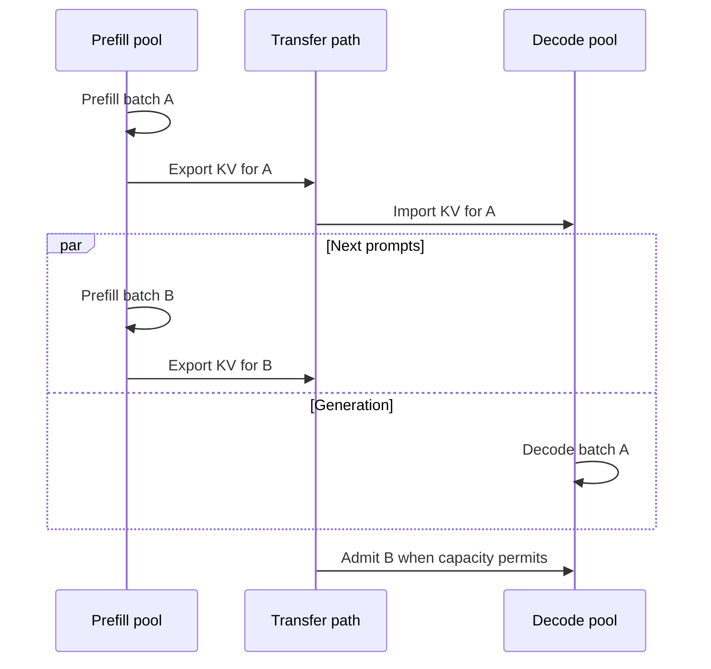
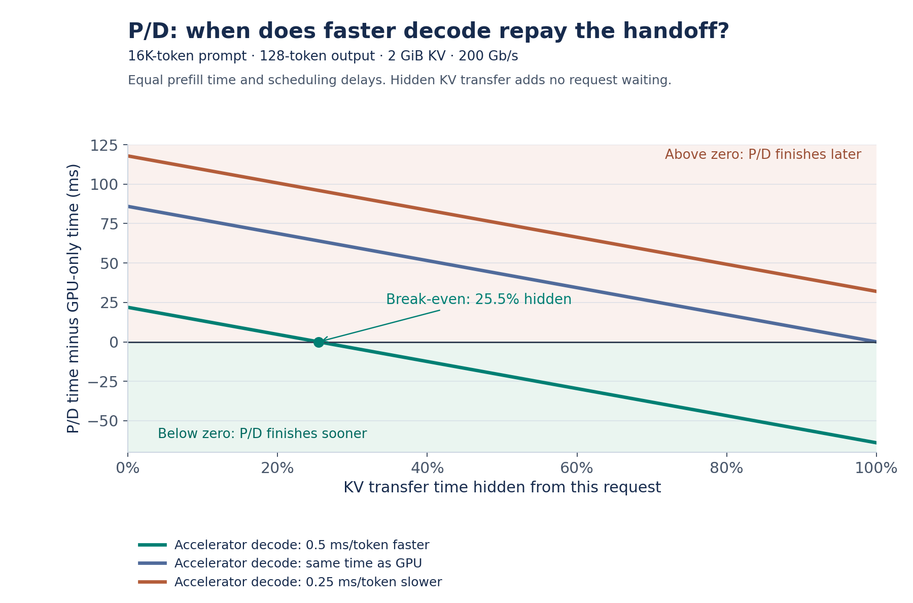
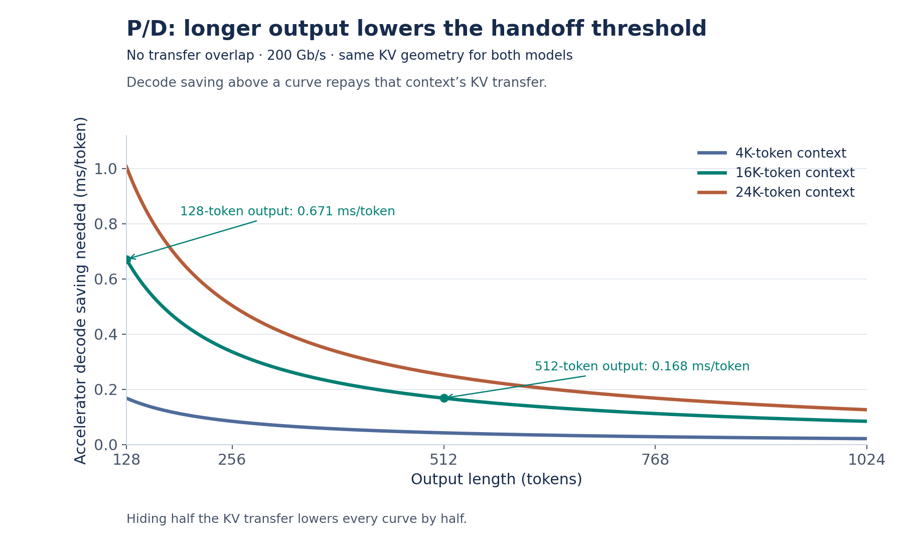
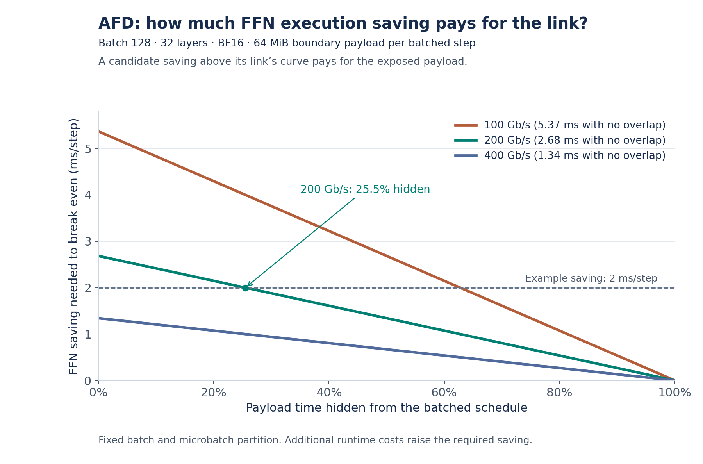

# When Does Heterogeneous Inference Pay Off?

*Choosing where to split execution across different kinds of hardware.*

Table of contents

- [1. What would we separate, and what would each side need?](#1-what-would-we-separate-and-what-would-each-side-need)
- [2. Can the faster hardware repay the handoff?](#2-can-the-faster-hardware-repay-the-handoff)
  - [P/D: when does decode repay the KV handoff?](#pd-when-does-decode-repay-the-kv-handoff)
  - [AFD: can the placement create enough useful work?](#afd-can-the-placement-create-enough-useful-work)
  - [T/D: what must cross between draft and target?](#td-what-must-cross-between-draft-and-target)
- [3. Why might production choose a path that benchmarks worse?](#3-why-might-production-choose-a-path-that-benchmarks-worse)
  - [How does current load change the decision?](#1-how-does-current-load-change-the-decision)
  - [What is the actual state-movement path?](#2-what-is-the-actual-state-movement-path)
  - [Can traffic sustain the batch and overlap?](#3-can-traffic-sustain-the-batch-and-overlap)
  - [Which path is worth benchmarking for this workload?](#which-path-is-worth-benchmarking-for-this-workload)
- [4. Will that decision survive a different workload or model?](#4-will-that-decision-survive-a-different-workload-or-model)
  - [If traffic shifts, can the fleet change roles?](#if-traffic-shifts-can-the-fleet-change-roles)
  - [If model state changes, does the original bottleneck still exist?](#if-model-state-changes-does-the-original-bottleneck-still-exist)
  - [If hardware improves, which term in the comparison changes?](#if-hardware-improves-which-term-in-the-comparison-changes)
  - [If the cost changes, should the software policy change too?](#if-the-cost-changes-should-the-software-policy-change-too)
- [Conclusion](#conclusion)
- [Appendix: model inputs and calculations](#appendix-model-inputs-and-calculations)

Apple Silicon’s shared memory made CPU/GPU disaggregation look easier. While building [`mini-vllm-rs`](https://github.com/lun0522/mini-vllm-rs), a single-node LLM inference engine for macOS, I considered prefill–decode disaggregation (P/D) and target–draft disaggregation (T/D, this article’s shorthand). But [Candle’s](https://github.com/huggingface/candle) device-based memory model complicated cross-device access. Synchronization and low concurrency also made it difficult to keep both devices busy. I implemented neither split, let alone attention–FFN disaggregation (AFD), which requires more frequent communication.

That experience raised a broader question: **when does matching different parts of inference to different hardware repay the cost of connecting them?** Many disaggregation studies focus on homogeneous GPU clusters. This article focuses on heterogeneous systems, including different GPU generations, CPU/GPU cooperation, and specialized accelerators working with or without GPUs.

The article follows four questions:

1. [**What would we separate, and what would each side need?**](#1-what-would-we-separate-and-what-would-each-side-need) Compare the workload requirements of P/D, AFD, and T/D and examine public hardware combinations. **Already familiar with all three? Skip to Section 2.**
2. [**Can the faster hardware repay the handoff?**](#2-can-the-faster-hardware-repay-the-handoff) Use concrete numbers to examine communication costs and compute–communication overlap. **Already comfortable with these trade-offs? Skip to Section 3.**
3. [**Why might production choose a path that benchmarks worse?**](#3-why-might-production-choose-a-path-that-benchmarks-worse) Examine how current load, state placement, and achievable batches change runtime decisions.
4. [**Will that decision survive a different workload or model?**](#4-will-that-decision-survive-a-different-workload-or-model) Consider how traffic, models, hardware, and software policy change the case for separation.

The goal is to build intuition using simplified calculations and public examples, rather than report new accelerator benchmarks. The examples reflect public information available in early October 2026. Implementations will change, but the underlying trade-offs remain useful.

## 1. What would we separate, and what would each side need?

Different parts of inference place different demands on compute, memory, and scheduling. The first question is which differences make separation useful and what new costs the separation introduces.

| Boundary | Workload on each side | Why consider this split? | What can erase the benefit? |
| --- | --- | --- | --- |
| **P/D** | **Prefill:** processes many prompt tokens together, reusing weights across them.  **Decode:** generates one token per request per step, repeatedly accessing weights with much lower data reuse at small batches and reading an expanding KV cache. | A long prefill can delay token generation for requests already decoding. Separate pools prevent that interference and let each phase choose its own batch size and parallelism. They also allow compute-heavy prefill and small-batch decode to use different hardware. With enough requests, prefill can process the next prompt while decode generates an earlier request's output. | Transferring KV adds waiting and network load. Long prompts and short outputs leave less decode work to repay that handoff. An imbalance between phases can leave one pool idle. |
| **AFD** | **Attention:** computes attention over each request's context and accesses its KV cache, which grows as the context length increases.  **Dense FFN:** applies the same weight matrices to each token, without context-length-dependent state.  **MoE FFN:** holds many experts' weights but activates only a subset per token. Routing determines how much work each expert receives. | Move FFN weights off the attention side, freeing capacity for more KV and active requests. Their tokens can form larger FFN batches, particularly valuable when MoE experts would otherwise receive too little work. Each side can also use hardware suited to its workload. | Activation exchanges recur at every layer. Communication and coordination can outweigh execution gains. More KV capacity helps only if additional requests can turn it into productive work. Small or uneven expert batches can still leave chips underused. |
| **T/D** | **Draft:** runs a smaller model repeatedly to propose tokens.  **Target:** verifies those proposals together, requiring the larger model and its state. | Use separate hardware for drafting without competing for the target device's resources. Several accepted proposals can replace multiple sequential target-model steps with one batched verification. | Low acceptance wastes draft work. Dependencies between proposal and verification can make both devices wait. Synchronization and any target-state feedback add costs beyond transferring token IDs. |

These differences also suggest what to look for in hardware. GPUs remain the most common choice because one flexible platform can handle all these workloads. Separation can happen within that platform: [DistServe](https://arxiv.org/abs/2401.09670) separates prefill and decode GPU workers, while [FastAFD](https://haoailab.com/blogs/fastafd/) evaluates attention and FFN/MoE separation within a GB200 NVL72 system.

Using hardware with different characteristics offers another opportunity to match each workload to a suitable device.

| Boundary | Hardware characteristics that could help | Hardware combinations and public evidence |
| --- | --- | --- |
| **P/D** | **Prefill:** high matrix compute throughput, with sufficient memory capacity and bandwidth to feed it.  **Decode:** at small batches, fast access to weights and KV, with low execution overhead. Larger batches increase weight reuse and can shift the balance toward compute, but also require capacity for more KV cache.  **Connection:** sufficient bandwidth for the prompt's KV handoff. | AWS Trainium (prefill) + Cerebras CS-3 (decode), [announcement](https://www.aboutamazon.com/news/aws/aws-cerebras-ai-inference).  NVIDIA Rubin GPU (prefill) + Groq LPX (decode), [announced configuration](https://developer.nvidia.com/blog/how-nvidia-groq-3-lpx-unlocks-ultrafast-interactivity-at-long-context-on-nvidia-vera-rubin/).  NVIDIA B200 (prefill) + SambaNova SN40 (decode), [demo](https://sambanova.ai/blog/first-disaggregated-inference-demo-for-ai-agents-live). NVIDIA H200 (prefill) + SambaNova SN50 (decode), [demo](https://sambanova.ai/blog/sn50-runs-fastest-minimax-speeds-in-the-world). |
| **AFD** | **Attention:** capacity and bandwidth for growing KV, plus efficient execution across unequal sequence lengths.  **FFN:** fast weight access and efficient matrix execution at achievable batch sizes. MoE additionally needs capacity for resident experts and efficient handling of small, uneven expert batches and dispatch across chips.  **Connection:** low latency and sufficient bandwidth for repeated activation exchanges. | NVIDIA H20 (attention) + NVIDIA L40S (experts), [MegaScale-Infer experiments](https://arxiv.org/html/2504.02263v1#S7.SS2).  NVIDIA Rubin GPU (attention) + Groq LPX (FFN/MoE), [announced configuration](https://developer.nvidia.com/blog/how-nvidia-groq-3-lpx-unlocks-ultrafast-interactivity-at-long-context-on-nvidia-vera-rubin/). |
| **T/D** | **Draft:** low latency at small batches. A small working set may allow weights to remain close to compute.  **Target:** capacity for the full model and KV, and efficient batched verification.  **Connection:** low synchronization overhead, including any feedback the drafting method requires. | GPU (target) + d-Matrix Corsair (draft), [Gimlet evaluation](https://gimletlabs.ai/blog/low-latency-spec-decode-corsair).  NVIDIA Rubin GPU (target) + Groq LPX (draft), [announced configuration](https://developer.nvidia.com/blog/how-nvidia-groq-3-lpx-unlocks-ultrafast-interactivity-at-long-context-on-nvidia-vera-rubin/).  NVIDIA A800 (target) + Intel Xeon CPU (draft), [DuoDecoding experiments](https://arxiv.org/abs/2503.00784). |

Rubin/Groq appears under all three boundaries, so choosing the chips does not by itself determine how to divide the work. To examine when a split pays off, we next put some concrete numbers behind these trade-offs.

## 2. Can the faster hardware repay the handoff?

Suppose we have a GPU platform and a second accelerator with faster FFN execution. Could using them together make inference faster, and where should we split the work?

Our focus is whether these splits still pay off with **incomplete compute–communication overlap**. A steady-state benchmark with a well-filled pipeline can show what a system achieves under favorable conditions. Production traffic may leave more communication exposed as arrivals, batch sizes, and stage workloads change. We therefore examine the range from no overlap to complete overlap, rather than assume that communication is fully hidden.

To make that question concrete, we will compare dense **Mistral-7B-Instruct-v0.2** with MoE **Mixtral-8×7B-v0.1**. They share the same layer count, hidden width, KV geometry, and FFN/expert width, but Mixtral replaces each dense FFN with eight experts and selects two per token. This gives us equal KV and AFD transfer sizes while changing weight capacity, computation, and routing.

For a simplified comparison, assume the following workload and deployment conditions. We will vary context length, output length, compute speedup, and the fraction of communication that remains exposed:

- **Request:** a **16,384-token (16K) prompt** and a 128-token output.
- **Precision:** BF16 weights, KV cache, and boundary activations, with no prefix reuse or compression.
- **Connection:** initially 200 Gb/s, corresponding to an ideal 25 GB/s payload rate. This is a [documented NIC speed](https://docs.nvidia.com/dgx/dgxa100-user-guide/introduction-to-dgxa100.html).
- **Starting conditions:** weights are loaded. We initially exclude differences caused by current load and additional scheduling delays, to isolate execution and communication.
- **Memory accounting:** sizes describe total memory required across the assigned workers. Runtime allocations, sharding, and replication can increase physical requirements.

### P/D: when does decode repay the KV handoff?

With P/D, the second accelerator takes over the entire decode workload, including attention and FFN. It must hold about **14.5 GB** of BF16 model weights for Mistral or **93.4 GB** for Mixtral, plus KV cache and workspace ([weight calculations](#weight-capacity-and-ffn-work)). Faster FFN execution helps only if attention and weight access do not erase that advantage.

Our 16K prompt produces **2 GiB of KV cache for either model** ([KV calculation](#kv-and-pd)). At 25 GB/s, transferring it takes **85.9 ms** of ideal payload time. To see whether faster decode repays it, compare two paths with the same GPU prefill and no differences in scheduling delay:

- **Without P/D:** GPU prefill + GPU decode.
- **With P/D:** GPU prefill + KV transfer time still exposed after overlap + accelerator decode.

To repay the full **85.9 ms** KV transfer, the accelerator must generate the same **128-token output more than 85.9 ms faster than the GPU**, averaging more than **0.671 ms saved per token**. We call this difference **decode time saving**, comparing both devices under matching workload conditions.

#### How much KV transfer must be hidden for P/D to pay off?

There are two different kinds of overlap to distinguish:

1. **Overlap between different requests.** The prefill pool processes new prompts while the decode pool generates earlier requests' outputs. This can keep both pools busy, but it does not automatically reduce an individual request's transfer wait.
2. **Overlap within the same request.** An implementation exports completed KV chunks or layers while that request's prefill is still running. Some KV can then arrive before prefill ends, reducing the transfer wait on its critical path.

The first kind produces a pipeline such as this:

The following chart examines the second kind of overlap, which can reduce A's waiting time.

In the chart, **“Hidden”** is the fraction of KV transfer time that adds no waiting to this request. We compare faster, equal, and slower accelerator decode, assuming unchanged prefill time.

*Figure 1. Values above zero mean P/D finishes later than keeping decode on the GPU. Values below zero mean P/D finishes sooner.*

Let's look at the **green curve**, where the accelerator decodes **0.5 ms/token faster than the GPU**, saving **64 ms over the 128-token output**. With no overlap, the 85.9 ms transfer exceeds that saving, so P/D finishes **21.9 ms later**. The paths break even when about **25.5% of the transfer is hidden**, at which point the remaining **64 ms of transfer wait** exactly matches the decode saving:

GPU prefill + GPU decode = GPU prefill + 64 ms of exposed KV transfer + accelerator decode.

Hiding more than that makes this request faster with P/D. At 50% hidden, about 42.9 ms of transfer remains exposed, so P/D finishes **21.1 ms sooner**.

If accelerator decode takes the same time as GPU decode (**blue line**), hiding all communication can only bring the paths to a tie. If accelerator decode is slower (**red line**), even completely hiding the transfer cannot make this request finish sooner under our matching-load assumptions. However, even when accelerator decode is equally fast or slower, P/D may still improve service capacity or reduce interference between requests, as we discuss in [a later section](#can-pd-still-be-useful-if-this-request-is-not-faster).

#### How do context and output length change the decision?

The chart below shows the decode time saving per token required to repay the KV handoff at different context and output lengths, assuming **no compute–communication overlap**.

*Figure 2. Accelerator decode must save more time per token than the relevant curve to repay the exposed KV handoff.*

For a **16K prompt**, accelerator decode must save more than **0.671 ms/token** over a **128-token output** to repay the 85.9 ms transfer. With a **512-token output**, the threshold falls to **0.168 ms/token**. Saving 0.5 ms/token would therefore repay the handoff for the longer output, but not the shorter one.

**Long context changes both communication and execution.** It increases the KV transfer cost, but also the KV accessed during decode. An accelerator that handles those accesses efficiently may gain a larger advantage over the GPU, while one that struggles with attention may lose its advantage.

**Long output spreads the handoff cost across more tokens**, but context continues growing during generation, so compare accumulated decode savings rather than a constant per-token saving.

Hence, Mistral and Mixtral have identical communication thresholds here, but their different weight footprints and FFN workloads can lead to different decode savings and P/D decisions.

#### Can P/D still be useful if this request is not faster?

Yes. A single-request speedup is only one reason to choose P/D:

1. **Reduce interference between phases.** Separating prefill and decode can prevent long prefills from interrupting existing requests' token generation, improving the consistency of token delivery.

2. **Free capacity on the prefill GPU.** After the KV handoff, the prefill GPU can release its copy instead of retaining it throughout generation, leaving room for new prompts. The KV still occupies memory in the decode pool, so this changes where capacity is available rather than reducing the request's total KV footprint.

3. **Scale each pool independently.** The prefill and decode pools can use different numbers of workers and scale up or down as demand changes, provided the transfer path can support the resulting traffic.

These benefits require spare decode capacity and sufficient transfer bandwidth.

If the second accelerator handles FFN well but struggles with attention or growing KV cache, handing it all of decode may still be the wrong split. AFD gives it a narrower role.

### AFD: can the placement create enough useful work?

AFD leaves attention and KV on the original platform and sends current activations to the second system for FFN execution. We will test two potential gains separately: faster execution of the same batch, and more productive batches enabled by moving weights.

#### How much capacity becomes available for KV?

In a decode-only attention pool with prefill supplied separately, moving FFN weights frees memory for KV. In BF16, those weights occupy about **11.3 GB for Mistral** and **90.2 GB for Mixtral**. With **2 GiB of KV per 16K-token request**, the freed space corresponds to roughly:

- **Mistral:** KV for **5 additional requests**.
- **Mixtral:** KV for **42 additional requests**.

These figures describe freed KV capacity, not guaranteed additional active requests ([memory accounting](#capacity-freed-for-attention)). The FFN pool still needs to hold the moved weights, and Mixtral may require several FFN chips per attention worker.

#### At the same batch, what execution saving pays for communication?

For a 128-token decode batch, AFD transfers **64 MiB of activations** across all layers ([calculation](#afd)). Holding the batch, microbatch partition, and attention execution fixed, the chart shows the FFN time saving needed to repay exposed communication.

“Hidden” means payload transfer time removed from the batched schedule. The curves exclude message startup and coordination overhead.

*Figure 3. For a fixed batch and microbatch partition, an FFN execution saving above the connection's curve repays the exposed payload transfer.*

Suppose the accelerator completes the FFN work **2 ms faster than the GPU**, represented by the **dotted horizontal line**:

1. **At 200 Gb/s**, transferring the activations takes **2.68 ms** without overlap, exceeding the execution saving by **0.68 ms**. The FFN saving repays the exposed payload-transfer cost above about **25.5% hidden**.
2. **At 100 Gb/s**, the transfer takes **5.37 ms**, requiring more than **62.7% hidden** for the FFN saving to exceed the exposed payload-transfer cost.
3. **At 400 Gb/s**, the transfer takes **1.34 ms**, so the 2 ms execution saving repays it even without overlap.

Hence, slower communication or smaller FFN time savings require more overlap.

The FFN saving here excludes gains from overlapping attention and FFN computation. At 16K, this 128-token decode batch also needs **256 GiB of KV** across the attention pool, so this batch would need to run across multiple chips.

AFD exchanges activations at every layer of every decode step, so a longer output does not amortize this communication cost as it does the one-time KV handoff in P/D. Those exchanges sit between dependent computations, so achieving the required overlap depends on the execution schedule.

#### When does freed capacity become a service benefit?

| What is happening before the split? | What does extra attention-side capacity change? | What would justify AFD? |
| --- | --- | --- |
| Few requests are active under low traffic, and none are waiting for KV space | The extra space stays unused | Faster execution or another service benefit must repay communication. Capacity alone contributes little. |
| Requests wait for KV space, but FFN is already saturated | Attention can admit more work, but the FFN queue grows | Admitting more requests is insufficient unless FFN capacity or execution improves too. |
| Requests wait for KV space and experts receive too few tokens | More resident requests, together with aggregation across attention workers, can form better expert batches | Those batches must improve useful service enough to cover communication and batch-formation waiting. |

The third case follows a conditional chain: **free weight space → retain more requests → deliver more tokens per expert → improve execution or service rate**. This requires enough requests and enough FFN capacity to process their tokens.

Compared with Mistral, moving Mixtral's experts frees much more capacity on the attention side, while the activation-transfer budget remains the same.

### T/D: what must cross between draft and target?

With T/D, proposals go to the target and verification results return to the drafter. Eight int32 candidate IDs occupy only **32 bytes**, so a token-based handoff can be small even when drafting and verification dominate the round.

Methods such as [EAGLE](https://arxiv.org/abs/2401.15077) make drafting depend on target features as well as tokens. For our targets, a 4,096-element BF16 hidden vector occupies **8 KiB per position**. Sending one vector for each of eight positions would therefore transfer **64 KiB**, compared with **32 bytes for eight token IDs**. This illustrates the size of a feature handoff, rather than the complete transfer protocol of a particular EAGLE implementation.

At 25 GB/s, that 64 KiB message takes about **2.6 microseconds** of ideal payload time ([message-size calculation](#td)). Its bytes need not create a bandwidth bottleneck, but message startup and synchronization can still matter. Even a tiny feedback message makes the drafter wait if it cannot start its next proposal until verification finishes.

These budgets tell us what a split must repay. In production, the runtime also needs to know what each supported path can deliver right now.

## 3. Why might production choose a path that benchmarks worse?

Production compares paths under **current load**, with state where it actually resides and batches that traffic can form. A path that loses a benchmark under the same workload may still finish a request sooner or protect other requests when GPU contention is high. Conversely, a benchmark advantage can disappear if the transfer path or traffic cannot support its assumed batch and overlap.

### 1. How does current load change the decision?

Keeping decode on the GPU means sharing its resources with the requests already running there. Suppose our GPU has completed a new request's prefill and is already decoding several other requests. An accelerator has spare decode capacity. The runtime has two choices:

1. **Keep decode on the GPU.** There is no KV handoff. However, admitting the request increases memory used by KV and adds work to subsequent decode steps. A larger batch may improve weight reuse, but it can also increase step duration or force the scheduler to divide requests across batches.
2. **Offload decode to the accelerator.** The request pays for the KV handoff and then shares the accelerator with its current workload. Its subsequent decode work no longer competes with the existing requests on the GPU.

Compare **decode completion time under each device's current load**, including the exposed KV transfer on the accelerator path. A slower accelerator in a benchmark under the same workload may finish sooner if contention on the GPU lengthens generation enough. Offloading can also protect existing GPU requests' token delivery, even if the new request finishes slightly later. Both reasons require spare accelerator and transfer capacity. If both devices are lightly loaded, the execution-and-transfer comparison becomes more informative.

**Request count alone is not enough.** One long request and ten short ones imply different service demand, and an existing batch changes admission cost. Prompt length is known, but output length usually must be estimated and updated during generation.

**Routing needs a prediction for the selected worker.** KV-cache-aware and predicted-latency routing, as supported by [llm-d](https://llm-d.ai/docs/0.8/architecture), provide useful inputs: resident state and expected latency under load. For heterogeneous workers, that prediction must also account for their supported execution plans and backends, along with exposed transfer time.

### 2. What is the actual state-movement path?

**The devices need a usable transfer path.** The [P/D example](#pd-when-does-decode-repay-the-kv-handoff) estimates 85.9 ms to transfer 2 GiB of KV cache at 25 GB/s. Owning two suitable accelerators establishes neither a usable path nor that effective rate. Endpoints must agree on tensor layout, precision, sharding, and state ownership. Export and import must make the data usable by the destination. A GPU in AWS and an accelerator in Azure do not automatically form such a path. Different GPU generations often share more software infrastructure, as illustrated by H100/A100 P/D in [Splitwise](https://arxiv.org/abs/2311.18677), but still require coordinated state movement.

**Fitting in the same rack does not tell us how fast devices can communicate.** Corsair fits air-cooled PCIe servers, and its [JetStream](https://www.d-matrix.ai/why-we-decoupled-execution-to-accelerate-i-o/) path supports device-initiated transfers over Ethernet across nodes. Those properties help integrate a deployment, but do not specify the measured GPU–Corsair connection. Likewise, fast links inside an LPU system do not establish its GPU-facing path. We need to identify each boundary rather than substitute the fastest interconnect advertised anywhere in the rack.

A homogeneous GPU deployment within one NVLink/NVSwitch domain has a real advantage here: fast interconnects and software that already supports transfers, especially valuable for AFD's recurring exchanges. An accelerator's workload advantage must be judged against that baseline, including any communication capability it gives up. Homogeneous GPUs across different network domains still require their own path assessment.

**Copy completion does not mean decode can begin.** Decode must also detect completion and schedule the request. In [vLLM's two-L40S experiment](https://vllm.ai/blog/2026-09-29-disaggregated-serving-guide), the GPUs had neither NVLink nor peer-to-peer copy support on the test machine. Roughly **470 MB of KV took about 1.3 seconds** to reach decode, although the authors expected host-staged PCIe 4.0 copies to take only tens of milliseconds. They attributed most of the delay to overhead around the copy, including completion polling between decode forward steps. This can leave a bubble between copy completion and request execution.

**Overlap does not remove bandwidth demand.** If ten requests per second each transfer **2 GiB of KV cache**, they require about **21.5 GB/s** of payload bandwidth, nearly the assumed **25 GB/s** link capacity before other traffic and protocol overhead. Overlapping those copies with compute does not remove their bytes or the resulting transfer queue. Tensor parallelism across eight chips does not automatically provide eight independent network paths. As traffic rises, a placement decision can congest the route even while the destination still has spare compute capacity.

**State location changes what must move.** Prefix KV could already be on another worker or in a shared tier. The runtime must compare using resident state, fetching it, and recomputing missing state. A cache hit on a busy worker is different from a cache hit on the intended decode owner. Fetching reusable KV can avoid compute while still paying network time. Infrastructure such as [Mooncake](https://www.usenix.org/conference/fast25/presentation/qin), tiered caches in llm-d, and [VAST's cache infrastructure](https://www.vastdata.com/blog/s3-over-rdma-scaling-the-kv-cache-data-plane) makes this state-location question practical. It does not make every hit a free handoff.

### 3. Can traffic sustain the batch and overlap?

The scheduler receives an evolving stream, not a fixed batch. Bursts, quiet periods, and request completions change both the tokens available for batching and the independent work available to hide communication.

**Resident experts need enough tokens to become productive.** Mixtral's eight expert sets require eight times Mistral's FFN weight capacity, while top-2 routing gives each token about twice the FFN matrix work. A batch can still touch all eight experts, so active work per token does not tell us how much expert weight the batch accesses or how many tokens reuse each expert's weights.

**Growing KV can shrink the active batch.** In our MoE example, increasing context from 16K to 24K raises KV from 2 to 3 GiB per request. Only about two-thirds as many requests fit in the same KV budget. In one decode step, four requests produce four tokens. With top-2 routing, those tokens create **eight token-to-expert assignments across eight experts**. Even balanced routing averages one token per expert. Distributing experts across more chips reduces the expert weights each chip must hold, but does not increase the number of tokens available to process at this active batch size. Some chips may have little work, and routing skew can additionally leave some busy while others wait.

**Forming a better expert batch can require more waiting.** Aggregation across attention workers gives the scheduler a choice: dispatch immediately for lower waiting, or collect more tokens for better expert execution. Unequal context lengths and arrivals change when work becomes ready. Multi-LoRA adds adapter-dependent work and resident memory, so the same request count can require different memory capacity and take a different time to execute. Hardware optimized for low-latency small batches and hardware needing larger matrix batches can favor different choices for this same traffic.

**Batching and overlap must be evaluated together.** Independent microbatches can let attention process one while FFN executes another and transport moves a third. Startup, drain, or unequal stage times leave bubbles. Creating more microbatches may improve overlap but shrink matrix batches and add coordination. Waiting for larger expert batches can improve execution while consuming the latency budget. [FastAFD](https://haoailab.com/blogs/fastafd/) illustrates a GPU schedule with enough work to keep its stages busy, while production arrivals and a heterogeneous connection determine how much communication remains exposed here.

A few takeaways:

1. Compare batch waiting, compute time, and exposed communication for the same schedule.
2. Include attention–FFN compute overlap. Do not combine the best compute timing from one configuration with the best overlap from another.
3. If handling uneven arrivals requires spare FFN capacity, include that capacity in the deployment cost.

This was the limitation of my opening CPU/GPU draft idea: with low concurrency, proposal–verification dependencies left too little independent work to keep both devices busy. More fleet traffic helps only if the scheduler can run another request while one waits for proposals, verification, or feedback.

### Which path is worth benchmarking for this workload?

Based on the analysis above, start with the bottleneck you observe. The following table identifies candidates to benchmark, rather than choosing a deployment from hardware specifications alone.

| Observed bottleneck or workload condition | Candidate to benchmark | What the benchmark needs to establish |
| --- | --- | --- |
| Long prefills interrupt active decode | P/D | Whether separation improves mixed-load TTFT and ITL after including the actual handoff |
| A second device suits complete decode | P/D | Whether full weights and KV fit, and decode savings repay exposed KV transfer |
| KV limits active requests and experts receive small batches | AFD | Whether freed capacity produces useful expert batches that repay repeated communication |
| A small drafter predicts the task well | T/D | Whether committed tokens per round repay drafting, verification, and feedback costs |
| GPU decode competes with other active work, while an accelerator has capacity | Decode offload | Whether offloading improves completion time or protects existing requests under current load |
| Traffic cannot keep separate pools busy | Colocated or flexible pools | Whether avoiding idle specialization improves latency and utilization at the actual arrival rate |

## 4. Will that decision survive a different workload or model?

Changes in traffic, model architecture, or hardware can create new opportunities for separation, but also make a carefully chosen configuration less effective than the alternatives.

### If traffic shifts, can the fleet change roles?

A runtime can move work away from an overloaded device, but it cannot make another device efficient at a role its hardware and software do not support. Consider a sustained shift toward long prompts and short outputs: prefill can become overloaded while dedicated decoders sit idle. Moving those decoders into prefill helps only if they have suitable kernels and enough capacity for that configuration.

[Dynamo Planner](https://docs.nvidia.com/dynamo/v1.5.0/knowledge-base/modular-components/planner/planner-guide) adjusts P/D replica counts using traffic and performance signals. Reassigning devices between roles additionally requires suitable execution support. Homogeneous GPU fleets often offer more options, although draining requests and loading weights still take time. Specialized hardware can be excellent at its assigned role yet unable to absorb demand elsewhere. That risk belongs in fleet planning alongside its current compute speedup. Flexibility is not exclusive to GPUs. [Tenstorrent](https://tenstorrent.com/solutions/llm-inference) supports both prefill and decode, but useful performance with the deployed kernels in each role determines which devices can actually be reassigned.

Total cost of ownership (TCO) includes not just purchase, power, cooling, and operations across all pools, but also the cost of capacity left idle after a sustained traffic shift.

### If model state changes, does the original bottleneck still exist?

Our capacity and transfer calculations used full attention with context-growing KV. A new attention architecture can reduce that state, change how it is accessed, or both. Those changes affect the colocated baseline as well as the split:

| Attention mechanism | Retained state and decode access | Effect on P/D | Effect on AFD |
| --- | --- | --- | --- |
| Full causal attention, including GQA/MQA | KV grows with context, and each step attends to history. Fewer KV heads reduce the coefficient. | Handoff grows with context. | Growing KV can limit batches and motivate separating FFN weights. |
| Recurrent linear attention | Update a fixed-size summary instead of reading full KV history. | Pure recurrent layers have bounded handoff state. | Growing-state pressure weakens, but compute and batching may still justify a split. |
| Sliding-window attention | Retain and read a bounded window in a rolling cache. | Transfer the window state rather than full history. | Less capacity pressure for purely local layers. |
| Sparse attention | Read selected tokens or blocks, but may still retain the full cache. | Fewer reads do not necessarily reduce handoff bytes. | Capacity pressure can remain. Selection and irregular access change execution. |
| [Multi-head latent attention (MLA)](https://arxiv.org/abs/2405.04434) | Compressed per-token state still grows with context. Kernels determine access and reconstruction. | Smaller state reduces the handoff. | Capacity benefit can shrink without shrinking FFN activation messages. |

Hybrid models combine these effects. [Kimi Linear](https://arxiv.org/abs/2510.26692) uses three recurrent KDA layers for each global MLA layer, so its global layers still retain context-growing state.

Model architectures that reduce retained state, such as MLA's compressed KV or linear attention's fixed-size state, can make P/D handoffs cheaper while reducing the need to use AFD to free memory. The colocated baseline can retain more requests and potentially form better expert batches. AFD's activation payload stays the same unless hidden width, layer count, precision, or the point of separation between attention and FFN changes. Faster local attention can also leave less compute time available to cover FFN and transport in a pipeline.

### If hardware improves, which term in the comparison changes?

The same test applies to a new accelerator generation. Three kinds of improvement change different parts of our example:

- **Capacity:** larger HBM can let the colocated baseline hold more KV and form better batches, reducing the need to use AFD to free memory. Adding memory to a specialized device can also make complete decode fit where only a small working set fitted before.
- **Effective access and execution:** capacity does not determine the cost of accessing state. Different memory tiers can have different access costs, and kernels must turn the chosen placement into execution gains. Adding DRAM to a specialized design, as in d-Matrix's [3D DRAM work](https://www.d-matrix.ai/going-vertical-why-we-created-a-3d-dram-solution-to-advance-low-latency-ai-inference/), changes this placement problem rather than making every byte behave like SRAM.
- **Communication:** a faster connection between the two devices lowers the repayment threshold, particularly for AFD's recurring exchanges. d-Matrix announced [NVLink Fusion integration for Raptor](https://www.d-matrix.ai/announcements/d-matrix-rackscale-nvidia/) in September 2026, showing that heterogeneous hardware is also being brought into fast scale-up ecosystems. The announcement does not disclose GPU–Raptor transfer bandwidth or latency.

### If the cost changes, should the software policy change too?

Changing a handoff's cost can change the policy worth running. P/D supports phase-specific batching and parallelism, while AFD allows a separate expert execution layout. For T/D, cheaper drafting raises a concrete question: should we propose more tokens per round or use a larger drafter? The benefit depends on how much extra draft work the target accepts and how much verification costs.

My own [speculative decoding benchmark](https://github.com/lun0522/mini-vllm-rs/blob/ff04aecc5365250c474570925e66087547e96bc6/benchmarks/speculative_decoding.md) illustrates how the choice differed between two tested prompts. Using a quantized Qwen2.5-7B target and Qwen2.5-0.5B draft model, proposing four draft tokens per verification round yielded an average of **3.95 accepted draft tokens** on the code-refactoring prompt, but only **1.24** on the creative-writing prompt. On the code-refactoring prompt, the adaptive policy selected the configured maximum of **eight draft tokens** in about **92%** of proposal-length decisions. It improved decode throughput over target-only for that prompt, but not for the creative-writing prompt.

These measurements used colocated drafting. A faster Corsair drafter could make longer proposals cheaper to generate. Whether they pay off still depends on acceptance, target verification time, and cross-device feedback costs.

## Conclusion

**Heterogeneity buys workload fit, while flexibility buys options when the workload changes.** Choosing a split determines where work and state live, and which dependencies cross between them. The runtime must judge whether that split produces useful service under current load. Fleet planning must also account for how much capacity can change roles as demand evolves.

GPU-only disaggregation has a substantial research foundation. As specialized AI accelerators proliferate, heterogeneous inference raises questions that remain less settled. One is whether a router should choose both **where and how** a request runs, using colocated execution, P/D, AFD, or T/D among supported plans. Selecting a plan at admission is easier than changing it mid-generation, when state ownership and in-flight work must also change.

This is where backend load balancing begins to become inference scheduling. My next article explores where the backend ends and the inference engine begins. Stay tuned.

## Appendix: model inputs and calculations

The main case uses the official configurations for [Mistral-7B-Instruct-v0.2](https://huggingface.co/mistralai/Mistral-7B-Instruct-v0.2/blob/main/config.json) and [Mixtral-8×7B-v0.1](https://huggingface.co/mistralai/Mixtral-8x7B-v0.1/blob/main/config.json). Both have full causal attention rather than a sliding window. These are logical footprints. Sharding, replication, padding, workspace, and implementation-specific transfers can change physical requirements.

| Configuration input | Mistral dense | Mixtral MoE |
| --- | ---: | ---: |
| Layers / hidden width | 32 / 4096 | 32 / 4096 |
| Query heads / KV heads / head dimension | 32 / 8 / 128 | 32 / 8 / 128 |
| Dense FFN / expert intermediate width | 14336 | 14336 |
| Experts per layer / selected per token | One dense FFN | 8 / 2 |
| Vocabulary / tied embedding and output weights | 32000 / no | 32000 / no |

### Weight capacity and FFN work

- **Dense FFN:** three matrices per layer give **3 × 32 × 4096 × 14336 = 5,637,144,576 parameters**. At two bytes each, that is **11.274 GB**.
- **MoE FFN:** eight copies of that expert structure give **45,097,156,608 resident parameters**, or **90.194 GB**. Two selected experts give **11.274B active FFN parameters per token**.
- **Other weights:** attention projections contribute **32 × (2 × 4096² + 2 × 4096 × 1024)** parameters. Input and output embeddings contribute **2 × 32000 × 4096**. Add two hidden-width normalization vectors per layer, a final norm, and **32 × 4096 × 8** router weights for Mixtral. This gives approximately **3.209 GB** outside the dense FFN or **3.211 GB** outside the MoE FFN.
- **Totals:** approximately **14.483 GB** and **93.406 GB**, respectively. These are aggregate weights across the assigned workers, not per-chip fit claims.
- **FFN matrix work:** counting a multiply-add as two FLOPs gives **11.274 GFLOPs/token** for dense and **22.549 GFLOPs/token** for MoE. Routing and elementwise work are excluded. Activated parameters describe matrix work, not measured execution time or batch-level memory traffic.

### Capacity freed for attention

Moving the dense FFN's **11,274,289,152 bytes** frees **10.5 GiB**. Moving all MoE expert weights frees **84 GiB**. At 2 GiB per 16K request KV set, these are **5.25** and **42** request-state equivalents. The main text rounds the first to about five. They do not include per-request workspace or imply usable capacity on every shard. Physical admission counts depend on the full layout, attention weights and workspace already resident on each chip, existing free space, and output growth. The weights remain resident in the separate FFN pool. The body's capacity example is a decode-only layout with prefill supplied separately. Fleet sizing must include that prefill capacity, the attention pool, and the FFN pool.

### KV and P/D

Both models store keys and values across 32 layers with eight KV heads of width 128. At BF16:

**2 × 32 × 8 × 128 × 2 = 131,072 bytes = 128 KiB per context token.**

Multiplying by 16,384 tokens gives **2,147,483,648 bytes = 2 GiB**. At 25,000,000,000 bytes/s, transfer time is **85.899 ms**. Divide by output count to obtain the average per-token saving required: **0.671 ms** for a 128-token output, **0.168 ms** for a 512-token output. Each request ultimately needs the KV on its decode owner. Permanent duplicate copies are not assumed.

### AFD

One full hidden vector in each direction at all layers gives:

**2 × 32 × 4096 × 2 = 524,288 bytes = 512 KiB per generated token.**

For batch 128, that is **67,108,864 bytes = 64 MiB**. Dividing by 25 GB/s gives **2.684 ms per batched step**, or **0.02097 ms** at batch 1. These are serialized payload-only times across all layers, excluding startup, overlap, metadata, and expert fan-out or collectives inside the FFN pool. The assumed boundary returns combined FFN results, not a separate full vector from every expert.

### T/D

Eight int32 candidates give **8 × 4 = 32 bytes**. An illustrative greedy-verification response containing an accepted-prefix length and next-token ID adds another **8 bytes**. Sampling methods can require probabilities or other state. Exporting one BF16 hidden vector gives **4096 × 2 = 8 KiB per position**, or **64 KiB for eight positions**, for either target. At 25 GB/s, 64 KiB takes approximately **2.62 microseconds** of ideal payload time. This sizes one hypothetical feature message, not a complete EAGLE protocol or drafter. Draft weights and draft state depend on the selected implementation and are additional to the target's weights and state.

### Reading the sensitivity charts

For Figure 1, let the hidden fraction vary from 0 to 1. The modeled remaining payload wait is **85.899 × (1 − hidden fraction) ms**. Subtract the total accelerator decode saving to obtain P/D completion time minus GPU-only completion time. The three curves use savings of **64, 0, and −32 ms** over a 128-token output. The green curve crosses at **1 − 64/85.899 = 25.494%** hidden. Equal prefill time and scheduling delays are assumed. Overlap with unrelated requests does not count toward this request's hidden fraction.

For Figure 2, divide the context's KV payload transfer time by output length to obtain the required average decode saving. The 4K, 16K, and 24K curves use transfer times of 21.475, 85.899, and 128.849 ms, respectively, with no overlap.

For Figure 3, the payload threshold at batch 128 is **2.684 × (200 / link rate in Gb/s) × (1 − hidden fraction) ms per batched step**. At a 2 ms FFN execution saving, the thresholds cross at **25.494%** hidden for 200 Gb/s and **62.747%** for 100 Gb/s. The 400 Gb/s curve has a 1.342 ms no-overlap threshold. Batch and microbatch partition are held fixed for this communication budget. Its FFN-saving term excludes gains from attention/FFN compute overlap. A changed partition or compute-overlap strategy needs a comparison of the resulting whole schedule.

The output count approximates decode-step count in this budget model. If prefill already emits the first output token, the receiving worker has one fewer decode step to repay its handoff.

Throughout, GB uses decimal units. GiB, MiB, and KiB use binary units. Configurations supply public model inputs. Footprints and curves are derived. Compute speedup and overlap are sensitivity variables. No transfer or execution benchmark of this heterogeneous pairing is claimed.
